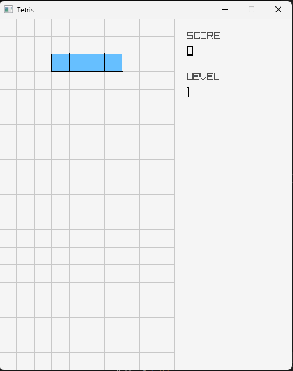
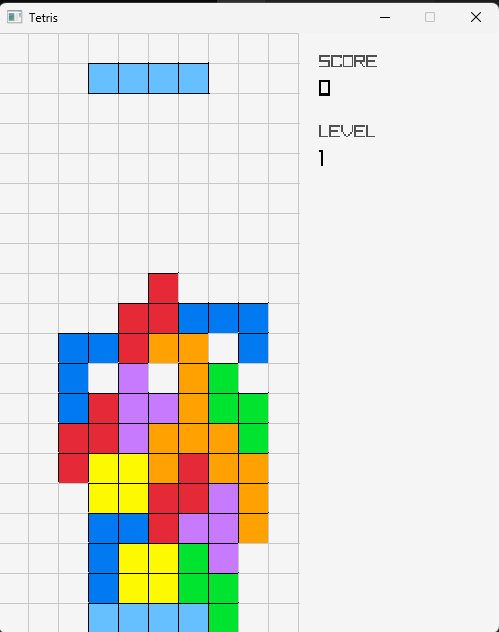

# Raylib Tetris

A Tetris clone built in C++ using [Raylib](https://www.raylib.com/). Made it as a learning project — classic gameplay, clean code, no dependencies beyond Raylib itself.

## Screenshots

| Start | Mid-game |
|-------|----------|
|  |  |

## Controls

| Key | Action |
|-----|--------|
| ← → | Move left / right |
| ↑ | Rotate clockwise |
| ↓ | Soft drop |
| Space | Hard drop |

## Scoring

Classic Tetris scoring, scales with level:

| Lines cleared | Points |
|---------------|--------|
| 1 | 100 × level |
| 2 | 300 × level |
| 3 | 500 × level |
| 4 (Tetris!) | 800 × level |

Level increases every 1000 points. Pieces fall faster as you level up.

## Building

Requires **CMake 3.20+** and a C++17 compiler. Raylib is fetched automatically via CMake FetchContent — no manual install needed.

```bash
git clone https://github.com/inkbytefo/raylib-tetris-example.git
cd raylib-tetris-example
cmake -B build
cmake --build build
```

Then run the executable from the `build` directory.

> **Note:** First build downloads Raylib (~5 MB) and compiles it. This takes a couple of minutes — subsequent builds are fast.

## Project Structure

```
MyGame/
├── main.cpp        # Entry point, window + game loop
├── Game.cpp/h      # Core game logic, input, scoring
├── Board.cpp/h     # 10×20 grid, line clearing
├── Tetromino.cpp/h # Piece shapes, rotation
└── Renderer.cpp/h  # Drawing with Raylib
```

## Tech

- **Language:** C++17
- **Graphics:** [Raylib 5.5](https://github.com/raysan5/raylib)
- **Build:** CMake with FetchContent
